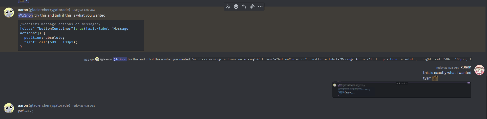

# Right Align Self Messages
Have your messages align over to the right :)

> [!IMPORTANT]  
> ThemeAttributes plugin must be ON for this to work

## Quick CSS
```css
@import url("https://raw.githubusercontent.com/its-x3non/DiscordSnippets/main/CSS%20Addons/Right%20Align%20Self%20Messages/RightAlign.css"); 
```
## Example

