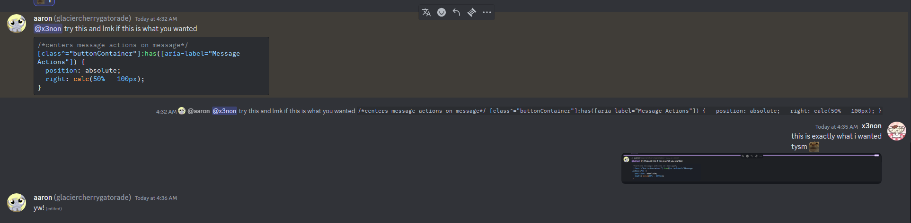
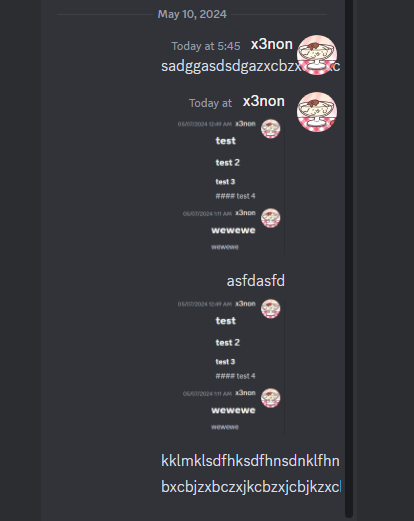

# Right Align Self Messages
Have your messages align over to the right :)

> [!IMPORTANT]  
> ThemeAttributes plugin must be ON for this to work

## Quick CSS
```css
@import url("https://raw.githubusercontent.com/its-x3non/DiscordSnippets/main/CSS%20Addons/Right%20Align%20Self%20Messages/RightAlign.css"); 
```
## Example


## Problems
- REALLY SMALL WINDOW and really LONG messages don't align properly (in threads)  


# Credits
Based off of Virtual Boy by [Riddim-GLiTCH](https://github.com/Riddim-GLiTCH)
### [Virtual Boy](https://github.com/Riddim-GLiTCH/Virtual-Boy) Credits (Taken directly from the theme)
- [Saltssaumure](https://github.com/Saltssaumure) - For helping me set up the theme properly, the modified settings pane, and the CSS-rules to make everything squared.
- [Blade04208](https://github.com/Blade04208) - for the watermarking tools used to display version numbers in the settings panel.
- [DaBluLite](https://github.com/DaBluLite) - For the improved user account details in the settings pane, and for helping set up [Colorways](https://github.com/DaBluLite/DiscordColorways) compatibility.
- aoithesceneryhoarder from the Vencord server - For the message bubbles and for the improved channel category dividers.
- [f53](https://f53.dev/) from the Vencord Server - For the improved chat input area, and the extended markdown fixes.
- [Vendicated](https://github.com/Vendicated) - for the About Me cut-off fix.
- [bernesealexxx](https://bernesealexxx.carrd.co/) from the Replugged server - for the CSS rules that re-add the "@" symbol back to usernames.
- zeylogger - for the unread pill modification in the channels.
- Barnyard - For the theme's Logo.
- [inxomnyaa](https://github.com/inxomnyaa) - for the [Native Title Bar Size](https://github.com/inxomnyaa/DiscordNativeTitlebarSize)
- Gibbu - for [Radial Status](https://github.com/DiscordStyles/RadialStatus)