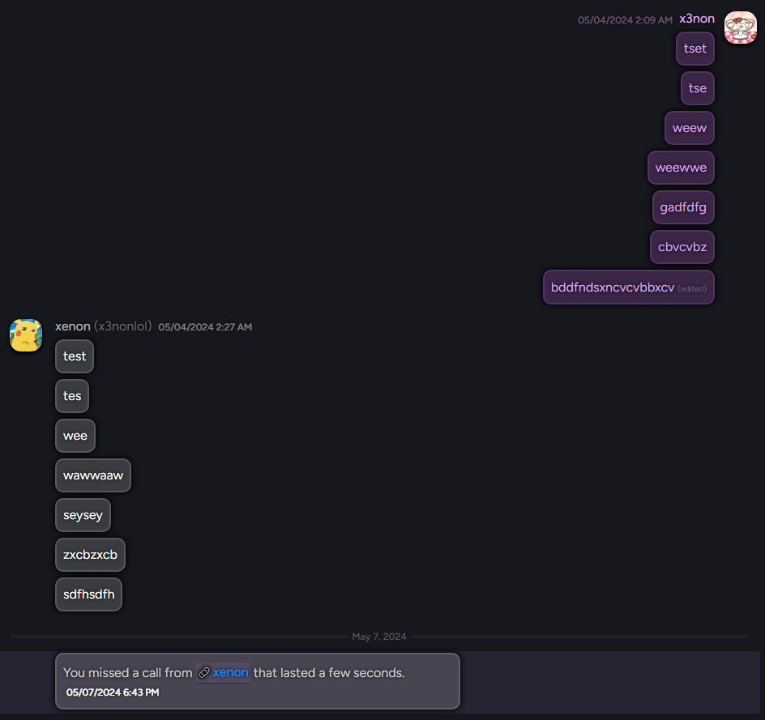

# Usage
> [!IMPORTANT]  
> If you want proper messaging allignment, i.e, your messages on the right side, use [Vencord](https://github.com/Vendicated/Vencord).  
> My main focus is Vencord, but I will work on a BetterDiscord Version at a later date.

# QuickCSS
```css
@import url("https://raw.githubusercontent.com/its-x3non/DiscordSnippets/main/ProperMessages/ProperMessages.theme.css");

:root {
  /* Default HSL values */
  --default-hue: 0;
  --default-saturation: 0%;
  --default-lightness: 80%;
  --default-alpha: 0.2;

  /* Self HSL values */
  --self-hue: 285;
  --self-saturation: 70%;
  --self-lightness: 65%;
}
```

> [!IMPORTANT]
> Still working on preview

# Preview


# Credits
- [Riddim GLiTCH](https://github.com/Riddim-GLiTCH) 
  - [Adding the @ Back to Usernames in Profiles](https://discord.com/channels/86004744966914048/836694789898109009/1237339626969108573) 
  - [Improved Links](https://github.com/Riddim-GLiTCH/Discord-CSS-Snippets/blob/main/snippets/Improved%20Links.md) Snippet
  - [Right Align Self Messages](https://github.com/Riddim-GLiTCH/Virtual-Boy/blob/main/src/addon/_selfmessages.scss)